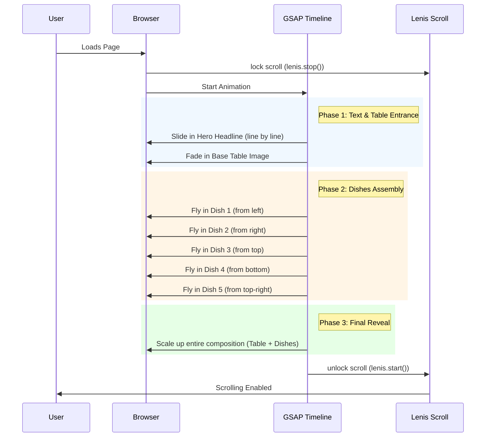

# Hero GSAP Animation & Scroll Lock

The goal is to replace the static `hero-food.png` image with a dynamic, composited scene using newly generated images. The page scroll will be disabled until the entrance sequence, which includes plates flying in and the final composition enlarging, completes.

## User Review Required
> [!IMPORTANT]
> **AI Image Generation Limitation**: The AI image generator (`generate_image`) typically produces images with solid backgrounds (e.g., solid white). While I can generate the 5 dishes, they may not be perfectly transparent out-of-the-box. 
> 
> **Proposed Solution**: I will generate the dishes with white backgrounds and use CSS `mix-blend-mode: multiply` to blend them into the table as a prototype. For the final production build, you may need to run these generated dishes through a background removal tool (like remove.bg).

## Proposed Changes

### 1. Asset Generation Strategy
We will use the `generate_image` tool to create the following assets:
- **Base Table (`table-base.webp`)**: A luxurious marble dining table set for an Indian feast, top-down view, with an empty center (no plates).
- **Dish 1 (`dish-butter-chicken.webp`)**: Top-down view of a copper bowl of butter chicken on a solid white background.
- **Dish 2 (`dish-biryani.webp`)**: Top-down view of a copper bowl of biryani on a solid white background.
- **Dish 3 (`dish-dal.webp`)**: Top-down view of a copper bowl of dal makhani on a solid white background.
- **Dish 4 (`dish-naan.webp`)**: Top-down view of a basket of naan bread on a solid white background.
- **Dish 5 (`dish-condiment.webp`)**: Top-down view of a small silver bowl of raita/condiment on a solid white background.

### 2. Animation Sequence Architecture (GSAP & Lenis)

Here is a diagram explaining the timeline of events we will implement:

### 3. Modifying `Hero.tsx`
- Implement a `useGSAP` or `useEffect` timeline.
- Absolute position the 5 dish images over the base table image.
- Apply the animation sequence defined above using GSAP `fromTo` and `timeline`.

## Verification Plan
1. Generate the 6 required images.
2. Build the composited UI in `Hero.tsx`.
3. Verify the scroll locks immediately on load.
4. Verify the GSAP timeline executes exactly as diagrammed (text -> table -> plates fly in -> scale up -> scroll unlocks).
